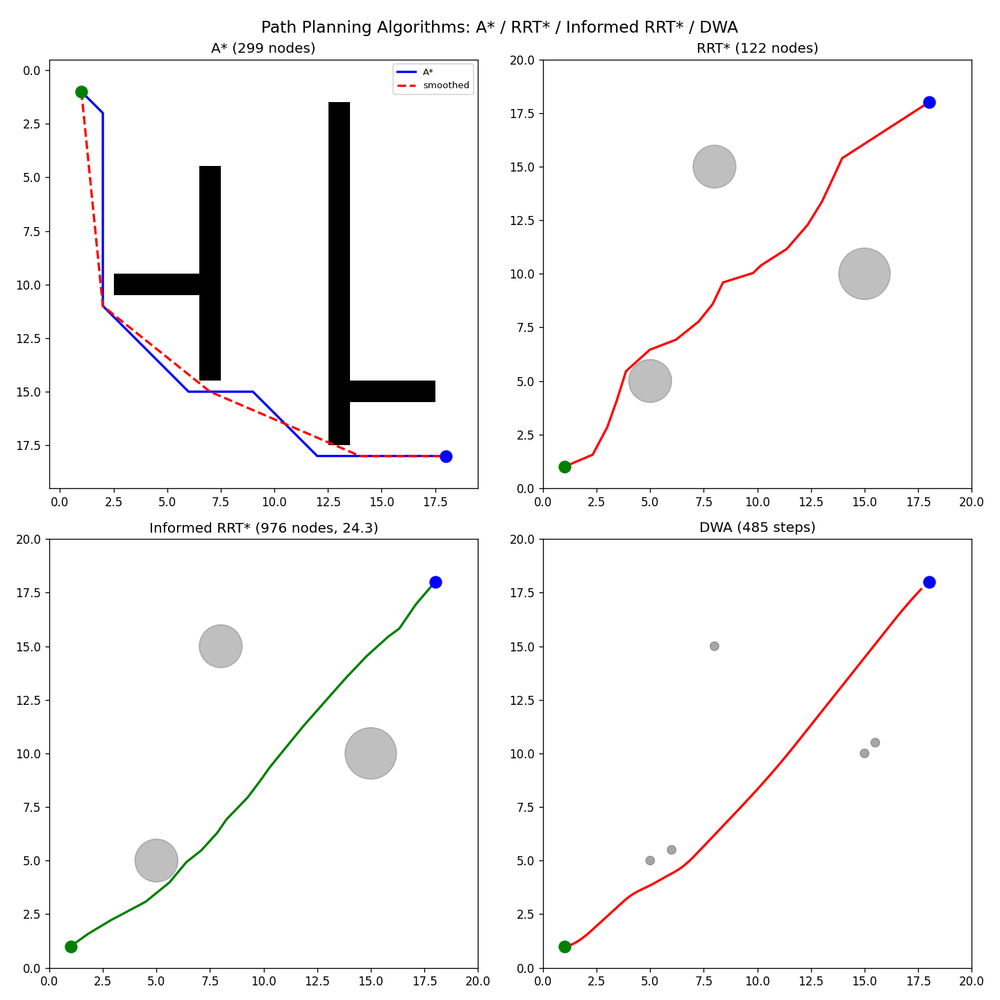
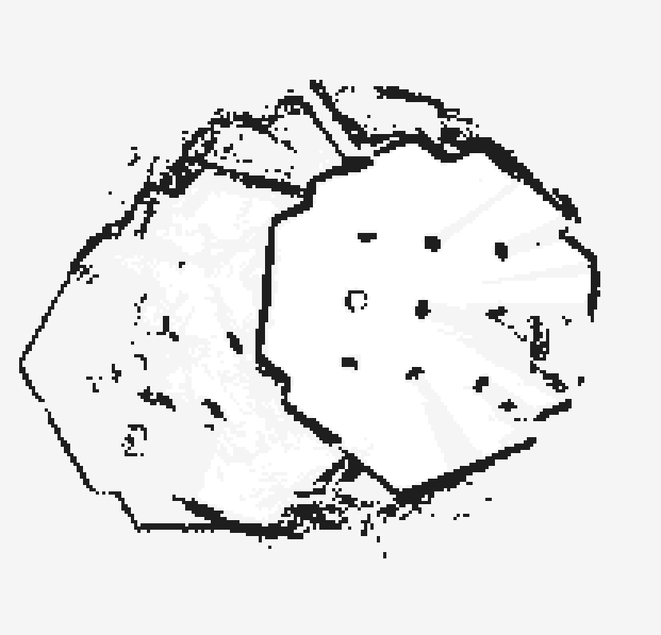
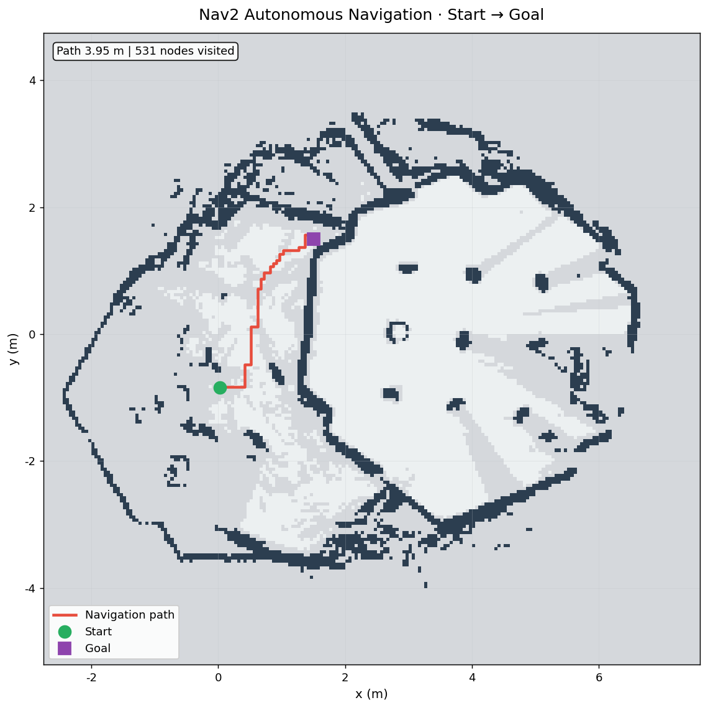

# Path Planning · 路径规划与导航 🗺️

> 从算法认知 → 体系认知 → 应用认知，真做导航的应用能力 + 科研能力。
> 基于权威调研（LaValle《Planning Algorithms》、2024 综述、Nav2、MATLAB 科研角色）。

## 🏆 成果

| 项 | 结果 |
|---|---|
| **手写算法库** | A\* / RRT\* / Informed RRT\* / DWA（可独立运行）|
| **算法测试** | 15 个测试全部通过 |
| **MATLAB 对比** | 同一算法三实现交叉验证 |
| **知识体系** | 8 篇（算法→体系→应用）|
| **仿真验证** | Gazebo 建图 → Nav2 导航全流程跑通（Ubuntu）|
| **A\* Nav2 插件** | 手写 A* 集成 Nav2 全局规划器（插件化，158 次规划 96.8% 成功）|



## 🎯 核心方法论

```
算法理解 → 手写实现 → 科研验证(MATLAB) → 系统集成(Nav2) → 作品集
  (知识)    (能力)        (严谨)          (落地)        (展示)
```

**三层认知**：
- **算法层**：A* / RRT* / DWA 原理与取舍
- **体系层**：算法在导航系统的位置（建图→定位→全局→局部→控制）
- **应用层**：MATLAB 仿真 vs ROS2 实际部署

## 📂 项目结构

```
path-planning/
├── algorithms/          # 手写算法库（Python）
│   ├── astar.py         # 图搜索类全局规划（含平滑）
│   ├── rrt_star.py      # 采样类全局规划（rewiring 渐近最优）
│   ├── dwa.py           # 局部规划（实时避障）
│   └── demo_all.py      # 三算法综合演示
├── matlab/              # MATLAB 科研验证对比
│   └── astar_matlab.m   # 手写 + Navigation Toolbox 对比
├── robot/               # TurtleBot3 巡检项目
│   ├── start_slam.sh    # SLAM 建图启动（正确时序）
│   ├── auto_explore.py  # 自动建图（移动轨迹）
│   ├── explore_laser.py # 激光自主探索建图（新增）
│   ├── nav_goal.py      # Nav2 目标导航脚本（新增）
│   └── save_map.py      # Python 保存地图
├── docs/                # 知识体系（算法→体系→应用）
│   ├── 01-路径规划基础与体系
│   ├── 02-全局规划算法
│   ├── 03-局部规划算法
│   ├── 04-SLAM建图与定位
│   ├── 05-导航系统闭环与部署
│   ├── 06-MATLAB科研验证实战
│   └── 07-ROS2仿真实战（Gazebo→SLAM→Nav2）
├── nav2_astar_plugin/   # 手写 A* 的 Nav2 全局规划插件（C++，可构建）
│   ├── src/astar_planner.cpp   # 手写 A* 全局规划器
│   └── astar_plugin.xml        # pluginlib 插件描述
├── tests/               # 算法测试（A*/RRT*/DWA）
├── exploration/         # 探索应用（动态障碍/性能基准）
└── results/             # 成果图（含建图/导航素材）
```

## ✅ 已完成的成果

### 1. 手写算法库（Python，可独立运行）
| 算法 | 类 | 状态 |
|---|---|---|
| **A\*** | 图搜索全局规划 | ✅ 含平滑、启发式效率统计 |
| **RRT\*** | 采样全局规划 | ✅ rewiring 渐近最优 |
| **Informed RRT\*** | 采样全局规划（前沿）| ✅ 椭圆采样加速最优 |
| **DWA** | 局部规划 | ✅ 实时避障 |

**统一接口**（`algorithms/planner.py`）：
```python
from planner import create_planner, plan
planner = create_planner("astar", grid=grid)
result = plan(planner, start, goal)  # 统一调用
```

**实测**（`results/algorithms_demo.png`）：
- A* 20x20 地图访问 42 节点找到路径（定向搜索高效）
- RRT* 采样探索渐近最优
- DWA 实时避障到达目标

### 2. 算法测试（可靠性验证）
**15 个测试全通过**（`tests/`）：
- A*：找路径/无路径/最优性/高效性/平滑
- RRT*：找路径/达目标/无碰撞
- DWA：到达目标/避障/输出合理

### 3. 算法对比基准（量化）
| 算法 | 路径 | 节点 | 耗时 | 最优性 |
|---|---|---|---|---|
| **A\*** | 27步 | 299 | 1.9ms | 最优 |
| **RRT\*** | 27步 | 179 | 150ms | 渐近最优 |

详见 [results/comparison.md](results/comparison.md)

### 4. 探索应用（前沿）
- **动态障碍 RRT\***：3 场景复杂度递增（`results/rrt_dynamic.png`）
- **性能基准**：A* vs RRT* 量化对比

### 5. MATLAB 科研验证（同一算法多实现对比）
- 手写 A*（324 节点）+ Navigation Toolbox（plannerAStarGrid）
- **科研意义**：三种实现（Python/MATLAB/Toolbox）交叉验证

### 6. 巡检导航（TurtleBot3 + Nav2 仿真）
- ✅ 环境搭建（Gazebo + TurtleBot3 + Nav2）
- ✅ SLAM 建图流程（Cartographer + 自动移动建图）
- ✅ Nav2 完整导航（Ubuntu 仿真跑通，自主到达目标点）

**仿真验证**（Gazebo 建图 → Nav2 导航全流程，详见 [07-ROS2仿真实战](docs/07-ROS2仿真实战.md)）：
- 建图结果：
- 导航截图：
- 导航视频：[nav_demo.mp4](results/nav_demo.mp4)（75s，1080p）
- **实测**：`(0.03,-0.84) → (1.5,1.5)` 与 `(1.5,1.5) → (-1.5,-1.5)` 均自主到达 ✅
- **踩坑收获**：解决 3 处 ROS2 QoS 兼容性（雷达 BEST_EFFORT / 初始位姿订阅）

### 7. 手写算法集成 Nav2 插件（研究验证的最强模式）

> 深度调研（2026-08）确认这是作品集可信度最高的模式，详见 [08-手写算法集成Nav2插件](docs/08-手写算法集成Nav2插件.md)。

- ✅ 手写 A* 通过 `nav2_core::GlobalPlanner` + pluginlib 成为 **Nav2 官方全局规划器**
- ✅ 配置即切换：`nav2_astar_params.yaml` 改一行即可切换默认/手写规划器
- ✅ **实测 158 次规划、96.8% 成功率**，驱动小车跨越迷宫
- 参考实现：TurtleBot-RRT-Star / nav2_dijkstra_planner 等（调研引用）

### 8. 知识体系（8 篇，算法→体系→应用）
- 01 基础与体系（导航系统全景）
- 02 全局规划（A*/RRT 原理与对比）
- 03 局部规划（DWA 实时避障）
- 04 SLAM 建图与定位（AMCL）
- 05 导航闭环（MATLAB vs 实际部署）
- 06 MATLAB 科研实战（A* 对比详解）
- 07 ROS2 仿真实战（Gazebo 建图 → Nav2 导航 + QoS 踩坑）
- 08 手写算法集成 Nav2 插件（A* 全局规划器）

## 🚀 快速开始

**算法演示**（纯 Python，无需 ROS）：
```bash
pip install -r requirements.txt
python algorithms/demo_all_algorithms.py   # 四算法对比可视化
python -m pytest tests/ -q -p no:anyio     # 15 个测试
```

**仿真验证**（Ubuntu 22.04 + ROS2 Humble，详见 [07-ROS2仿真实战](docs/07-ROS2仿真实战.md)）：
```bash
ros2 launch turtlebot3_gazebo turtlebot3_world.launch.py                                  # ① Gazebo 世界
ros2 launch turtlebot3_cartographer cartographer.launch.py use_sim_time:=True             # ② Cartographer 建图
python robot/explore_laser.py 90                                                          # ③ 自动探索（激光避障）
ros2 run nav2_map_server map_saver_cli -f ~/map/room                                      # ④ 保存地图
ros2 launch turtlebot3_navigation2 navigation2.launch.py map:=~/map/room.yaml use_sim_time:=True  # ⑤ Nav2 导航
python robot/nav_goal.py 1.5 1.5                                                          # ⑥ 自主导航到目标
python robot/nav_goal.py --patrol "1.5,1.5;-1.5,-1.5;1.5,-1.5"                            # ⑦ 多目标巡检
```

**手写 A\* 作为 Nav2 全局规划器**（详见 [08-手写算法集成Nav2插件](docs/08-手写算法集成Nav2插件.md)）：
```bash
cd nav2_astar_plugin && colcon build --packages-select astar_nav2_plugin && source install/setup.bash
ros2 launch turtlebot3_navigation2 navigation2.launch.py map:=~/map/room.yaml \
  params_file:=robot/config/nav2_astar_params.yaml use_sim_time:=True                      # 用 A* 插件导航
```

## 🔄 进行中 / 待完善

- 前沿探索自主建图（frontier-based，接入 Nav2）
- 局部规划器对比（DWA / TEB / MPPI 在动态障碍场景）
- 小车控制板 PCB（硬件分支，见规划）

## 📚 文档导航

| 文档 | 内容 |
|---|---|
| [01-路径规划基础与体系](docs/01-路径规划基础与体系.md) | 导航系统全景 |
| [02-全局规划算法](docs/02-全局规划算法.md) | A\* / RRT 原理与对比 |
| [03-局部规划算法](docs/03-局部规划算法.md) | DWA 实时避障 |
| [04-SLAM建图与定位](docs/04-SLAM建图与定位.md) | AMCL 定位原理 |
| [05-导航系统闭环与部署](docs/05-导航系统闭环与部署.md) | MATLAB vs 实际部署 |
| [06-MATLAB科研验证实战](docs/06-MATLAB科研验证实战.md) | A\* 对比详解 |
| [07-ROS2仿真实战](docs/07-ROS2仿真实战.md) | Gazebo 建图 → Nav2 导航 |
| [08-手写算法集成Nav2插件](docs/08-手写算法集成Nav2插件.md) | A\* 全局规划器插件化 |
| [算法对比基准](results/comparison.md) | 手写算法 vs Nav2 量化对比 |

## License

MIT
