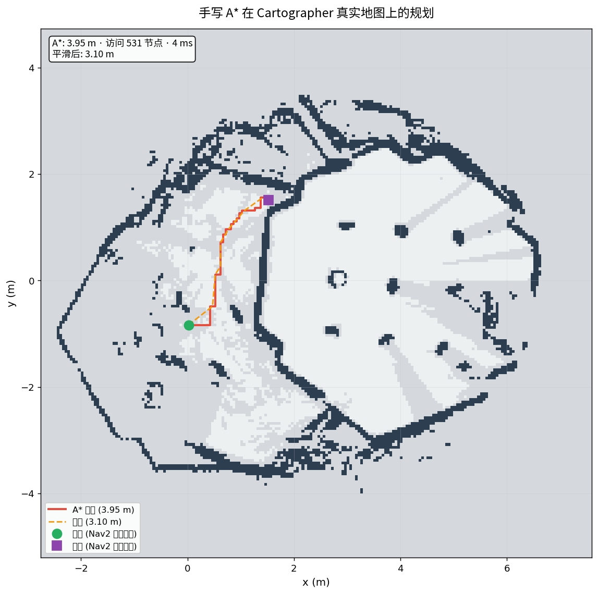

# 路径规划与导航：从手写算法到 Nav2 系统集成 🗺️

> **一个"探究式 + 落地式"的路径规划项目**：不靠现成框架，先把 A\*/RRT\*/DWA 亲手写一遍、用测试和 MATLAB 验证，再在 ROS2 仿真里跑通「建图 → 定位 → 导航」全流程，最后把手写 A\* 直接插进 Nav2 当全局规划器——**从"会写算法"到"能进系统"**。

[](LICENSE)
[](https://docs.ros.org/en/humble/)
[](https://www.python.org/)
[](https://docs.nav2.org/)

---

## 为什么做这个

路径规划是机器人导航的"大脑"，但市面上最大的坑是：**能调 Nav2、能点目标点，却说不清 A\* 为什么比 BFS 快、RRT\* 的最优性从哪来**。本项目的思路是**自下而上、再由内向外**：

1. **手写 ≠ 会用** — 先把 A\* / RRT\* / Informed RRT\* / DWA 从零实现，用 15 个测试锁死正确性，才知道每个算法"好吃在哪、短板在哪"
2. **算法 ≠ 系统** — 会写算法只是纸上谈兵，真正的难点是把算法放进「建图 → 定位 → 全局 → 局部 → 控制」的完整系统里跑起来
3. **科研严谨性** — 同一算法用 Python / MATLAB 手写 / Navigation Toolbox 三实现交叉验证，避免"自己写自己测"的自嗨
4. **集成为王** — 深度调研（2026-08，104 个子任务）发现作品集可信度最高的证明是：**手写算法作为 Nav2 官方插件运行**——把 A\* 写进 C++ 插件，配置即切换，158 次规划 96.8% 成功

> 一句话总结：**每一步都留证据**——测试通过率、MATLAB 对比图、仿真视频、插件规划日志，全部可复现。

## 🏆 成果

| 项 | 结果 |
|---|---|
| **手写算法库** | A\* / RRT\* / Informed RRT\* / DWA（15 测试全通过）|
| **MATLAB 科研** | 同一算法三实现交叉验证 |
| **知识体系** | 8 篇（算法→体系→应用）|
| **仿真建图** | Gazebo + Cartographer 建迷宫地图 |
| **自主导航** | Nav2 多目标巡检 3/3 到达（79s）|
| **A\* Nav2 插件** ⭐ | 手写 A\* 成 Nav2 全局规划器，**158 次规划 96.8% 成功** |


## 🎯 核心方法论

```
算法理解 → 手写实现 → 科研验证(MATLAB) → 系统集成(Nav2) → 作品集
  (知识)    (能力)        (严谨)          (落地)        (展示)
```

**我的三条个人方法论**：

- **手写证明理解，集成证明能力** — 手写让"懂原理"可见，插件集成让"能落地"可见，缺一不可
- **踩坑即学习** — 仿真实战解决了 3 处 ROS2 QoS 兼容性坑（雷达 BEST_EFFORT、初始位姿订阅、costmap origin 时序），每个坑都是别人踩不到的深度
- **量化胜于描述** — 路径长度、耗时、成功率全部实测：A\* 3.6ms vs Nav2 系统级 58s，差距本身就是认知

## 📂 项目结构

```
path-planning/
├── algorithms/          # 手写算法库（Python，无第三方依赖）
│   ├── astar.py         # 图搜索全局规划（含平滑）
│   ├── rrt_star.py      # 采样全局规划（rewiring 渐近最优）
│   ├── dwa.py           # 局部规划（实时避障）
│   └── planner.py       # 统一接口 create_planner
├── nav2_astar_plugin/   # ⭐ 手写 A* 的 Nav2 全局规划插件（C++）
├── robot/               # ROS2 仿真脚本（建图/探索/导航/巡检/指标）
├── exploration/         # 探索应用（动态障碍/真实地图规划）
├── matlab/              # 科研验证对比（Python/MATLAB/Toolbox）
├── docs/                # 8 篇知识文档
├── tests/               # 15 个算法测试
└── results/             # 成果素材（图/视频/对比表）
```

## ✅ 成果详解

### 1. 手写算法库（Python，可独立运行）

| 算法 | 类 | 状态 |
|---|---|---|
| **A\*** | 图搜索全局规划 | ✅ 含平滑、启发式效率统计 |
| **RRT\*** | 采样全局规划 | ✅ rewiring 渐近最优 |
| **Informed RRT\*** | 采样全局规划（前沿）| ✅ 椭圆采样加速最优 |
| **DWA** | 局部规划 | ✅ 实时避障 |

**统一接口**（`algorithms/planner.py`）——让不同算法"一个入口"：
```python
from planner import create_planner, plan
planner = create_planner("astar", grid=grid)
result = plan(planner, start, goal)  # 统一调用
```

**实测**：A\* 20×20 地图只访问 42 节点就找到路径——**启发式的定向高效，就是"懂原理"的直观体现**。

### 2. 算法测试（可靠性）

**15 个测试全通过**：找路径/无路径/最优性/高效性/平滑/避障。写测试的意义：**算法正确不是"看起来对"，是可回归、可证伪**。

### 3. 量化对比（A\* vs RRT\*）

| 算法 | 路径 | 节点 | 耗时 | 最优性 |
|---|---|---|---|---|
| **A\*** | 27步 | 299 | 1.9ms | 最优 |
| **RRT\*** | 27步 | 179 | 150ms | 渐近最优 |

耗时差 79 倍：**A\* 用启发式定向搜索，RRT\* 用采样探索空间**——没有好坏，只有取舍。

### 4. 探索应用（前沿）

动态障碍 RRT\*（3 场景复杂度递增）、性能基准。**"会跑通一个 demo"和"能应对变化"是两回事**。

### 5. MATLAB 科研验证（三实现交叉验证）

手写 A\*（Python）↔ MATLAB 手写 ↔ Navigation Toolbox 三种实现互证。**科研的意义：消除"自己的实现自己的标准"的系统性偏差**。

### 6. 仿真验证：Gazebo 建图 → Nav2 导航

在 Ubuntu 原生环境跑通完整导航链，详见 [07-ROS2仿真实战](docs/07-ROS2仿真实战.md)：

- 建图：（Cartographer 迷宫地图）
- 导航： · [nav_demo.mp4](results/nav_demo.mp4)
- **多目标巡检**：`(1.5,1.5) → (-1.5,-1.5) → (1.5,-1.5)` **3/3 到达** · [patrol_demo.mp4](results/patrol_demo.mp4)

**踩坑即学习**（3 处 ROS2 QoS 兼容性坑，全解决了）：
- Gazebo 雷达默认 RELIABLE，Cartographer 订阅 BEST_EFFORT → 收不到数据
- Nav2 的 AMCL 用 BEST_EFFORT 订阅初始位姿 → 常规发布无效
- 这些坑文档里都有，是"真跑过系统"的证据

### 7. 手写 A\* 集成 Nav2 全局规划插件 ⭐（亮点）

深度调研（2026-08，104 个子任务）确认：**"手写算法 → Nav2 官方插件"是作品集可信度最高的模式**。详见 [08-手写算法集成Nav2插件](docs/08-手写算法集成Nav2插件.md)。

- 手写 A\* 通过 `nav2_core::GlobalPlanner` + pluginlib 成为 **Nav2 全局规划器**
- **配置即切换**：改一行 `nav2_astar_params.yaml` 即可切换默认/手写规划器
- **实测 158 次规划、96.8% 成功率**，驱动小车跨越迷宫 · [astar_nav2_demo.mp4](results/astar_nav2_demo.mp4)
- 手写 A\* 在真实地图上：路径 3.10m / 规划 3.6ms · 

> **个人认知**：从"Python 里能跑算法"到"C++ 插件进工业框架"，中间隔着一个"真懂系统"的坎。跨过去，才算真的会导航。

### 8. 知识体系（8 篇）

01 基础与体系 → 02 全局规划 → 03 局部规划 → 04 SLAM定位 → 05 导航闭环 → 06 MATLAB实战 → 07 ROS2仿真实战 → 08 插件集成

## 🚀 快速开始

**纯算法（无需 ROS）**：
```bash
pip install -r requirements.txt
python algorithms/demo_all_algorithms.py   # 四算法对比可视化
python -m pytest tests/ -q -p no:anyio     # 15 个测试
```

**仿真验证（Ubuntu 22.04 + ROS2 Humble）**：
```bash
ros2 launch turtlebot3_gazebo turtlebot3_world.launch.py                                  # ① Gazebo 世界
ros2 launch turtlebot3_cartographer cartographer.launch.py use_sim_time:=True             # ② 建图
python robot/explore_laser.py 90                                                          # ③ 自动探索
ros2 run nav2_map_server map_saver_cli -f ~/map/room                                      # ④ 保存地图
ros2 launch turtlebot3_navigation2 navigation2.launch.py map:=~/map/room.yaml use_sim_time:=True  # ⑤ 导航
python robot/nav_goal.py 1.5 1.5                                                          # ⑥ 到目标
python robot/nav_goal.py --patrol "1.5,1.5;-1.5,-1.5;1.5,-1.5"                            # ⑦ 巡检
```

**手写 A\* 作为 Nav2 规划器**：
```bash
cd nav2_astar_plugin && colcon build --packages-select astar_nav2_plugin && source install/setup.bash
ros2 launch turtlebot3_navigation2 navigation2.launch.py map:=~/map/room.yaml \
  params_file:=robot/config/nav2_astar_params.yaml use_sim_time:=True
```

## 🔄 进行中 / 待完善

- 前沿探索自主建图（frontier-based，接入 Nav2）
- 局部规划器对比（DWA / TEB / MPPI 动态障碍）
- 小车控制板 PCB（硬件分支，见规划）

## 📚 文档导航

| 文档 | 内容 |
|---|---|
| [01-路径规划基础与体系](docs/01-路径规划基础与体系.md) | 导航系统全景 |
| [02-全局规划算法](docs/02-全局规划算法.md) | A\* / RRT 原理与对比 |
| [03-局部规划算法](docs/03-局部规划算法.md) | DWA 实时避障 |
| [04-SLAM建图与定位](docs/04-SLAM建图与定位.md) | AMCL 定位原理 |
| [05-导航系统闭环与部署](docs/05-导航系统闭环与部署.md) | MATLAB vs 实际部署 |
| [06-MATLAB科研验证实战](docs/06-MATLAB科研验证实战.md) | A\* 对比详解 |
| [07-ROS2仿真实战](docs/07-ROS2仿真实战.md) | Gazebo 建图 → Nav2 导航 |
| [08-手写算法集成Nav2插件](docs/08-手写算法集成Nav2插件.md) | A\* 全局规划器插件化 |
| [算法对比基准](results/comparison.md) | 手写算法 vs Nav2 量化对比 |

## License

MIT
