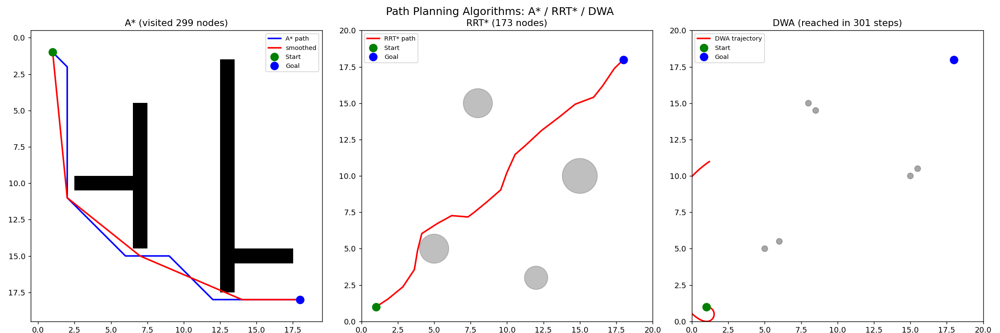

# Path Planning · 路径规划与导航 🗺️

> 从算法认知 → 体系认知 → 应用认知，真做导航的应用能力 + 科研能力。
> 基于权威调研（LaValle《Planning Algorithms》、2024 综述、Nav2、MATLAB 科研角色）。

## 🏆 成果

| 项 | 结果 |
|---|---|
| **手写算法库** | A\* / RRT\* / DWA（可独立运行）|
| **MATLAB 对比** | 同一算法三实现验证 |
| **知识体系** | 6 篇（算法→体系→应用）|
| **巡检导航** | TurtleBot3 + Nav2（Ubuntu 完善）|



## 🎯 核心方法论

```
算法理解 → 手写实现 → 科研验证(MATLAB) → 系统集成(Nav2) → 作品集
  (知识)    (能力)        (严谨)          (落地)        (展示)
```

**三层认知**：
- **算法层**：A* / RRT* / DWA 原理与取舍
- **体系层**：算法在导航系统的位置（建图→定位→全局→局部→控制）
- **应用层**：MATLAB 仿真 vs ROS2 实际部署

## 📂 项目结构

```
path-planning/
├── algorithms/          # 手写算法库（Python）
│   ├── astar.py         # 图搜索类全局规划（含平滑）
│   ├── rrt_star.py      # 采样类全局规划（rewiring 渐近最优）
│   ├── dwa.py           # 局部规划（实时避障）
│   └── demo_all.py      # 三算法综合演示
├── matlab/              # MATLAB 科研验证对比
│   └── astar_matlab.m   # 手写 + Navigation Toolbox 对比
├── robot/               # TurtleBot3 巡检项目
│   ├── start_slam.sh    # SLAM 建图启动（正确时序）
│   ├── auto_explore.py  # 自动建图（移动轨迹）
│   └── save_map.py      # Python 保存地图
├── docs/                # 知识体系（算法→体系→应用）
│   ├── 01-路径规划基础与体系
│   ├── 02-全局规划算法
│   ├── 03-局部规划算法
│   ├── 04-SLAM建图与定位
│   ├── 05-导航系统闭环与部署
│   └── 06-MATLAB科研验证实战
└── results/             # 成果图
```

## ✅ 已完成的成果

### 1. 手写算法库（Python，可独立运行）
| 算法 | 类 | 状态 |
|---|---|---|
| **A\*** | 图搜索全局规划 | ✅ 含平滑、启发式效率统计 |
| **RRT\*** | 采样全局规划 | ✅ rewiring 渐近最优 |
| **DWA** | 局部规划 | ✅ 实时避障 |

**实测**（`results/algorithms_demo.png`）：
- A* 20x20 地图访问 42 节点找到路径（定向搜索高效）
- RRT* 采样探索渐近最优
- DWA 实时避障到达目标

### 2. MATLAB 科研验证（同一算法多实现对比）
- 手写 A*（324 节点）+ Navigation Toolbox（plannerAStarGrid）
- **科研意义**：三种实现（Python/MATLAB/Toolbox）交叉验证

### 3. 巡检导航（TurtleBot3 + Nav2）
- ✅ 环境搭建（Gazebo + TurtleBot3 + Nav2）
- ✅ SLAM 建图流程（Cartographer + 自动移动建图）
- 🔄 Nav2 完整导航（WSL 环境攻坚中）

### 4. 知识体系（6 篇，算法→体系→应用）
- 01 基础与体系（导航系统全景）
- 02 全局规划（A*/RRT 原理与对比）
- 03 局部规划（DWA 实时避障）
- 04 SLAM 建图与定位（AMCL）
- 05 导航闭环（MATLAB vs 实际部署）
- 06 MATLAB 科研实战（A* 对比详解）

## 🔄 进行中 / 待完善

- Nav2 完整导航（建议在 Ubuntu 原生环境跑，WSL 有 Gazebo/DDS 限制）
- 探索应用：手写算法替换 Nav2 规划器
- 小车控制板 PCB（硬件分支，见规划）

## 📚 文档导航

| 文档 | 内容 |
|---|---|
| [作品集方案](references/m5-作品集方案.md) | 调研确认的完整方案 |
| [知识图谱](references/m5-路径规划知识图谱.md) | 三层认知框架 |
| [PCB 全景蓝图](references/m5-pcb全景蓝图.md) | 硬件分支规划 |

## License

MIT
